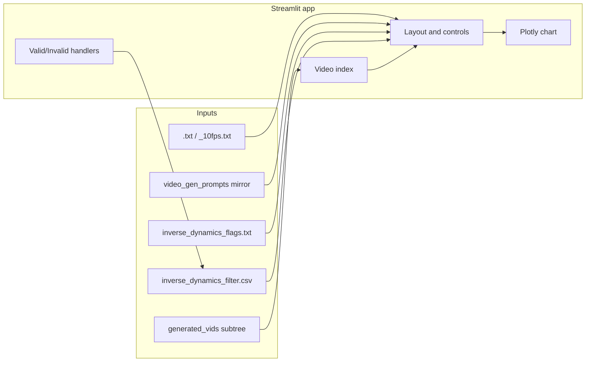

# Inverse-Dynamics Validation App Plan

Build a Streamlit app under [`data/cosmos3/data_validation/`](../data/cosmos3/data_validation/) to manually validate inverse-dynamics velocity/heading trajectories against videos, with synced plotting, prompt action sentences, heuristic FLAG notes, and CSV result persistence.

Spec: [`spec/spec_ID_validation_app.md`](spec_ID_validation_app.md)

## Goal

Local Streamlit UI to walk videos under a chosen subtree of [`data/datasets/generated_vids`](../data/datasets/generated_vids), compare each clip to its inverse-dynamics trajectory (`.txt` / `_10fps.txt`), show the expected action sentence + heuristic FLAG status, and write/overwrite labels into [`data/cosmos3/data_validation/inverse_dynamics_filter.csv`](../data/cosmos3/data_validation/inverse_dynamics_filter.csv).

## Locked decisions

| Topic | Choice |
| --- | --- |
| Action sentence | Reuse `last_sentence()` / same resolution as ID script |
| Heuristic CSV value | `FLAGGED` or `OK` |
| Folder load | Recursive `.mp4` under selected folder |
| Missing trajectory | Show error card; still allow navigation |
| Re-label | Overwrite row; pre-fill label/comment; info toast if already in CSV |
| After Valid/Invalid | Auto-advance to next |
| Queue | All videos in folder (no FLAG-only filter) |
| Stack | Streamlit |
| Location | `data/cosmos3/data_validation/` |
| Deps | Add UI deps as an optional dependency group |
| Plan file | `spec/plan_ID_validation_app.md` |

## Architecture



### Layout (single page)

```
[ Action sentence (top) ]
[ Heuristic FLAG note if any ]
[ Folder picker | metric: i / N | prior-label toast ]
[ Video (left)          | Trajectory plot (right) ]
[ Prev | Next ]  [ Downsampled | Full FPS ]  [ Velocity | Heading ]
[ Real-time plot toggle ]
[ Valid | Invalid ]
[ Comment text area ]
```

## File layout

Under [`data/cosmos3/data_validation/`](../data/cosmos3/data_validation/):

| File | Role |
| --- | --- |
| `app.py` | Streamlit entrypoint (layout, widgets, navigation, save handlers) |
| `io_utils.py` | Discover videos, load trajectories, parse flags, CSV read/write |
| `prompt_utils.py` | Thin wrappers importing shared prompt-resolution helpers |
| `plotting.py` | Plotly figure builders; HTML bridge for real-time sync |
| `inverse_dynamics_filter.csv` | Results store (already exists, empty) |

Run:

```bash
uv run --group validation streamlit run data/cosmos3/data_validation/app.py
```

## Dependencies

Add a `[dependency-groups] validation` entry in [`pyproject.toml`](../pyproject.toml) so CUDA/main deps stay untouched:

- `streamlit`
- `plotly`
- `pandas`

No Gradio/FastAPI.

## Data contracts

### Videos

- Root: `data/datasets/generated_vids` (absolute via repo-root discovery like the ID script).
- Session folder: user-selected relative path under that root (text input + Load).
- Discover: recursive `**/*.mp4`, sorted by relative path.
- Do not require trajectories to appear in the index (error card instead).
- Empirically: clips are ~5.04s at 24 fps (~121 frames); trajectories are length 30 @ 5 Hz and 60 @ 10 Hz.

### Trajectories

- Downsampled (default): `<stem>.txt` — 5 Hz (`TARGET_HZ` in ID script).
- Full FPS: `<stem>_10fps.txt` — 10 Hz.
- Format: JSON list `[[velocity_mph, heading_deg], ...]` (same as ID writer).
- Time axis: `t_i = i / hz` (hz = 5 or 10). Plot cursor uses video `currentTime` clamped to trajectory end.

### Prompt / action sentence

Reuse logic from [`data/cosmos3/run_inverse_dynamics.py`](../data/cosmos3/run_inverse_dynamics.py):

- `resolve_prompt_file`, `prompt_sentence_for`, `last_sentence`
- Prefer **importing** these. If importing `run_inverse_dynamics` triggers `bootstrap_runtime_env` / CUDA re-exec, **move** the three pure helpers into e.g. [`data/cosmos3/prompt_resolve.py`](../data/cosmos3/prompt_resolve.py) and have both the ID script and the app import from there. Minimal surgical extract — no behavior change.

Display: sentence at top; if unresolved, show muted “Action sentence unavailable” (not an error card unless trajectory is also missing).

### Heuristic flags

Parse [`data/datasets/generated_vids/inverse_dynamics_flags.txt`](../data/datasets/generated_vids/inverse_dynamics_flags.txt):

- Lines matching `FLAG  <rel_path>: ...`
- Build `set[str]` of relative posix paths (normalize to match CSV / video rel paths).
- If current video in set: show note under action sentence (e.g. “Heuristic validation: FLAGGED”) and optionally the remainder of the FLAG line for context.
- CSV column `Heuristic Validation`: write `FLAGGED` when in set, else `OK`.

### CSV schema

Path: `data/cosmos3/data_validation/inverse_dynamics_filter.csv`

Columns (exact headers):

1. `Video filepath relative to "data/datasets/generated_vids"` — posix relative path including `.mp4`
2. `Valid/Invalid` — `Valid` or `Invalid`
3. `Heuristic Validation` — `FLAGGED` or `OK`
4. `Comment` — free text (may be empty)

Behavior:

- Load entire CSV into session state on start / after each write.
- On Valid/Invalid: upsert by video path (overwrite), then write atomically (temp file + replace).
- Pre-fill comment + show prior label when row exists; `st.info`: “This video is already in the CSV (…).”
- Auto-advance index `i → i+1` after save (clamp at end; stay on last with success message).
- Comment is saved only with Valid/Invalid (no separate Save button).

## Streamlit interaction design

### Session state keys

- `folder_rel`, `video_paths: list[Path]`, `index: int`
- `traj_mode: "downsampled" | "full_fps"`
- `series: "velocity" | "heading"`
- `realtime_plot: bool` (default True)
- `comment: str` (synced when index changes from CSV)
- `csv_df`, `flag_set`
- `show_already_labeled_info: bool` (True when landing on a labeled video)

### Controls

- Folder: text input relative to `generated_vids` + “Load” button (re-scan recursive mp4s, reset index to 0). Validate path is inside root (no `..` escape).
- Prev/Next: change index; reload comment from CSV; set toast flag if labeled.
- Trajectory source radio; series radio; realtime checkbox.
- Valid / Invalid: write CSV, clear toast, auto-advance.
- Comment: `st.text_area`.

### Video + plot sync

Native `st.video` does not expose `currentTime` to Python. **Implement an HTML video + Plotly panel via `st.components.v1.html`** as the real-time path:

- Native video controls (pause / replay / scrub).
- On `timeupdate`, update a vertical cursor on the Plotly chart at `currentTime`.
- Prefer full series + moving vline (context) over truncating the series.
- Toggle “Disable real-time plotting” → full curve via pure Streamlit + Plotly, no cursor updates.

Plot details:

- X: time (s); Y: mph or deg; title/units switch with series.
- Missing/corrupt JSON: error card; Valid/Invalid still enabled.

### Error card

When selected trajectory file missing or unreadable:

- Alert with expected path(s) and which mode failed.
- Disable plot; video still plays if present.
- Navigation and labeling still work.

## Reuse / surgical extract from ID script

Functions to share (pure, no torch):

- `last_sentence`, `resolve_prompt_file`, `prompt_sentence_for`

Do **not** change heuristic validation logic in the ID script beyond the extract.

## Edge cases

- Empty folder → message, no crash.
- Last video Valid/Invalid → save, stay, “End of folder”.
- Concurrent edits: single-user local tool; last write wins (no locking).
- Path normalization: always posix relative from `generated_vids` with forward slashes (match FLAG file format).
- Variant stems `prompt_3_v07`: prompt index trim already handled by `prompt_sentence_for`.
- `_variants` folders: prompt resolution already handled by `resolve_prompt_file`.

## Implementation order

1. Extract/share prompt helpers if needed for safe import.
2. `io_utils.py` — discovery, traj load, flags parse, CSV upsert.
3. `plotting.py` — full-curve Plotly + HTML video/timeupdate bridge.
4. `app.py` — full UI wiring.
5. Add `validation` dependency group; document run command (README or short note in this folder).
6. Smoke-test against `positive_scenarios_filtered` + a FLAGGED path and CSV overwrite flow.

## Verification checklist

1. Load `final_semantic_scenarios/positive_scenarios/positive_scenarios_filtered` → only that subtree’s mp4s (recursive).
2. Action sentence matches ID script for `prompt_0.mp4` (last sentence after stripping trailing `(...)`).
3. FLAG note appears for a path listed in `inverse_dynamics_flags.txt`.
4. Toggle Downsampled vs Full FPS changes point count (~2×).
5. Velocity vs Heading switches Y units.
6. Real-time on: cursor tracks video playback; off: full curve immediate.
7. Valid writes CSV; revisit shows toast + pre-filled comment; Invalid overwrites.
8. Auto-advance after label.
9. Missing `.txt` shows error card; can still mark Invalid.

## Out of scope

- HF upload/download of CSV or videos
- Re-running inverse dynamics or heuristics
- Multi-user auth
- Keyboard shortcuts (nice-to-have later)
- Filtering to FLAGGED-only
